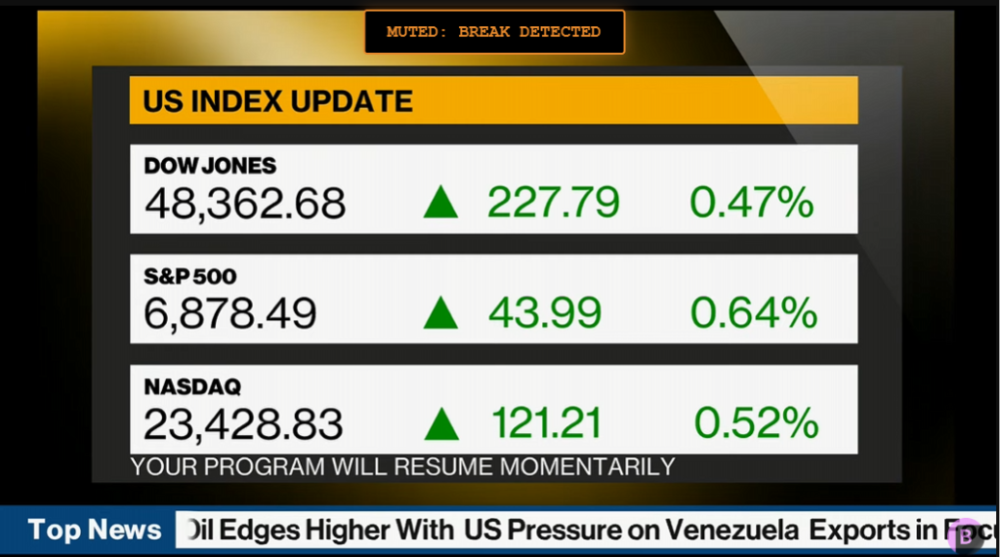

# Bloomberg Muter

A specialized Chrome extension designed to enhance the viewing experience of the Bloomberg Live YouTube broadcast.

## Features
- **Automatic Muting**: Uses OCR (Tesseract.js) to detect "Resuming Momentarily" break screens and automatically silences the audio.
- **Smart Unmuting**: Automatically restores audio when the broadcast returns, with built-in stability to prevent flickering sound.
- **Manual Override**: Click the on-screen status indicator to manually unmute for 60 seconds if you want to skip the automatic silence.
- **Bloomberg Terminal Aesthetic**: A custom UI designed to match the iconic terminal look (Orange on Black).
- **Lightweight**: Runs keyword detection every 2 seconds to ensure minimal performance impact.

## Installation
1. Download or clone this repository.
2. Open Chrome and navigate to `chrome://extensions/`.
3. Enable "Developer mode" in the top right.
4. Click "Load unpacked" and select the project folder.

## How it Works
The extension captures a frame of the video, processes it into a high-contrast black-and-white image, and uses Tesseract.js (running in an offscreen document) to scan for specific keywords. If a match is found, the audio is muted via a persistent "enforcer" loop.

## Disclaimer
This project is for educational/personal use. "Bloomberg" is a trademark of Bloomberg Finance L.P. This extension is not affiliated with or endorsed by Bloomberg.
